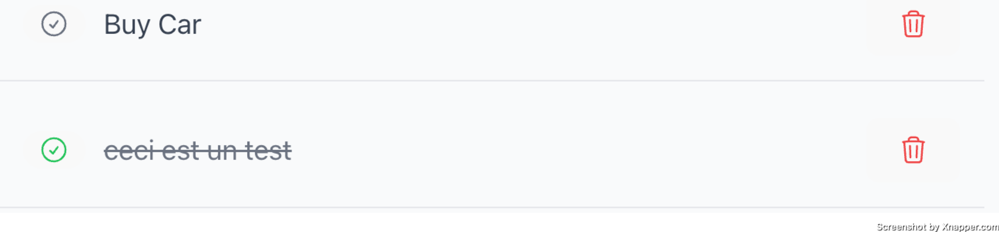

# Énoncé de l’application

Un développeur était en train de développer une application de TODO (CRUD).

Il a du abandonner le projet. Cependant, il y a des bugs et des fonctionnalités manquantes sur l’app actuel.

## Backend

- Impossible de supprimer une task

- Quand les tâches sont récupérées pour un utilisateur, d’autres tâches sont récupérées

## Frontend

- Il y a un souci d’affichage quand on met à jour les tâches (Create/Update)

- Impossible de changer l’utilisateur connecté

- Impossible de supprimer une task

- L’affichage des tâches ne correspond pas à la maquette et n’est pas responsive

## Objectifs

- Fait un fork de ce repository et n'oublie pas de faire des commits pour pousser tes modifications

- Résous tous les points d’en haut

- (Si tu as le temps) Analyse le code et fais des propositions de modifications afin d'améliorer l’application (Backend, Frontend, Produit, Design, Librairies à utiliser, etc), on en discutera par la suite !
  
> PS : On te demande de faire des suggestions de modifications, pas de les implémenter, donc n'hésite pas à faire des propositions même si tu n'es pas expert dans les technologies utilisées !

Temps : 30mins/1h Back + 30mins/1h Front
